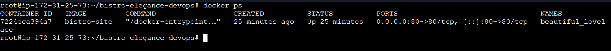
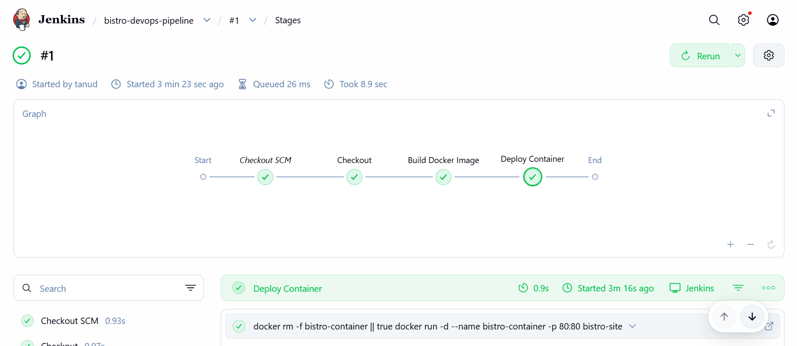
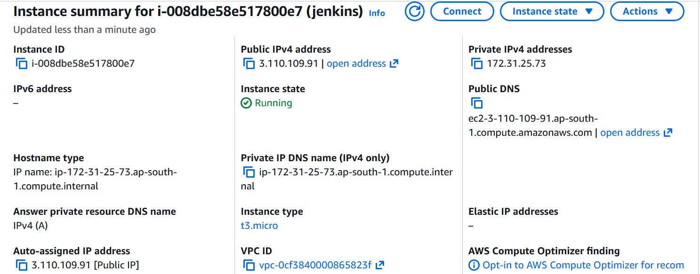

# 🚀 CI/CD Pipeline for Static Website Deployment

## 📌 Overview
Automated deployment of a static website using Jenkins, Docker, and AWS EC2.  
Whenever code is pushed to GitHub, Jenkins builds and deploys the application automatically.

---

## 🛠️ Tech Stack
AWS EC2 | Jenkins | Docker | Nginx | GitHub | Linux

---

## ⚙️ Pipeline Flow
GitHub → Jenkins → Docker Build → Deploy on EC2

---

## 📸 Screenshots

### 🌐 Live Website

### 🐳 Docker Container

### ⚙️ Jenkins Pipeline

### ☁️ AWS EC2

---

## 💡 Key Highlights
- Automated CI/CD pipeline  
- Dockerized deployment  
- GitHub webhook integration  
- Live deployment on AWS  

---
